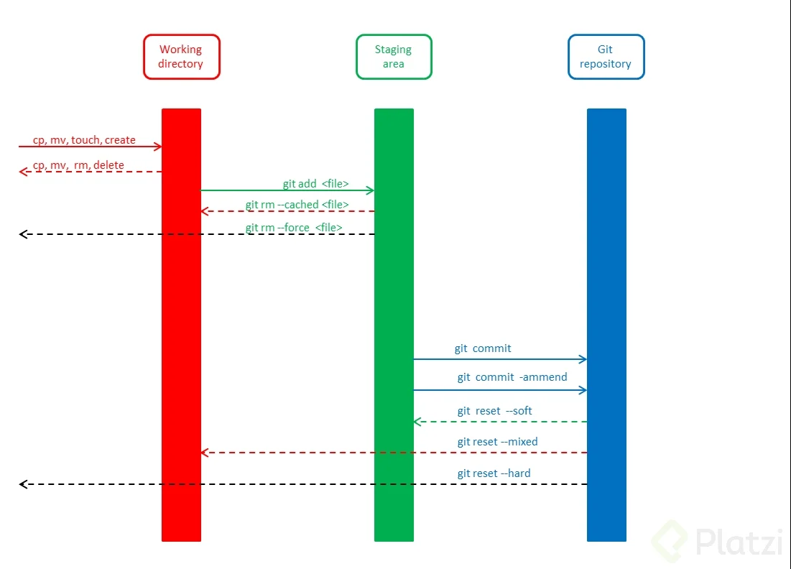
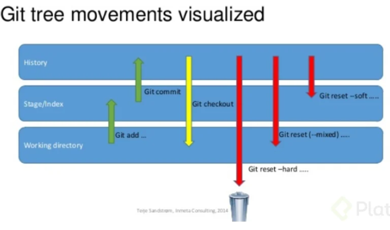
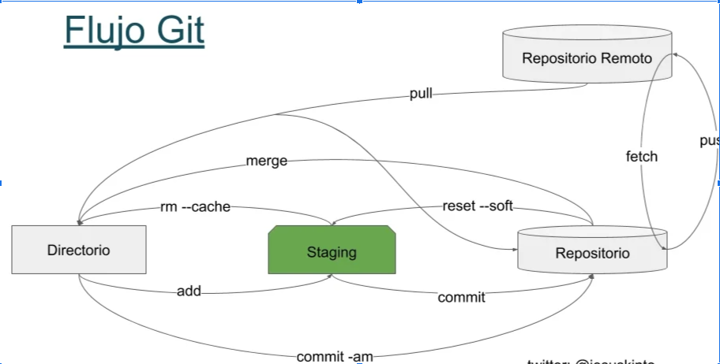
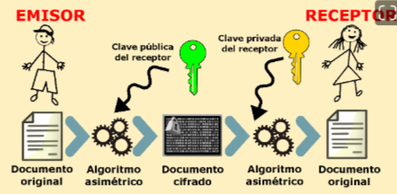
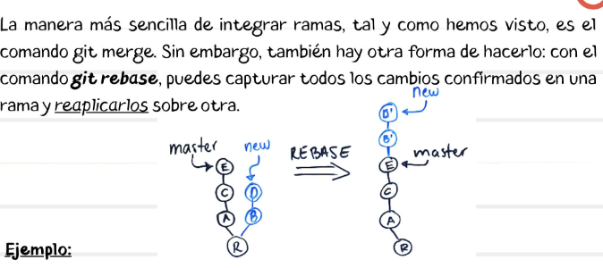

## MANEJO DE GIT

Es un sistema de control de versiones, pensado para la eficiencia y la confiabilidad de mantenimiento de versiones de un proyecto.

### GIT INIT
Se usa para inicializar el repositorio git.

### GIT ADD
Se usa para ingresar el archivo al estado staging.

### GIT STATUS
ver el estado, si se requiere agregar al starget o si se requiere commit.

### GIT ADD .
Se usa para ingresar el archivo al estado staging. Pero con el punto indicamos que vamos a ingresar todos los archivos que hayan tenido cambios.

### GIT COMMIT -M “DESCRIPCION”
Envía los cambios del archivo a la base de datos del control de versiones.

### GIT SHOW
Muestra todos los cambios que hemos hecho a los archivos.

### GIT LOG.
Muestra el historial de cambios completos.

### GIT LOG --STAT
Muestra el historial pero con la cantidad de archivos modificados.

### GIT CONFIG --LIST
Muestra la lista de configuraciones.

### GIT CONFIG --LIST  –SHOW-ORIGIN
para mostrar las configuraciones y sus ruta

### CONFIG –GLOBAL
Se configura el usuario que hará los cambios.

* git config --global user.email "tu@email.com"
* git config --global user.name "Tu Nombre

* Si por algún motivo te equivocaste en el nombre o email que configuraste al principio, lo puedes modificar de la siguiente manera:

* git config --global --replace-all user.name 
* “Aquí va tu nombre modificado”
* O si lo deseas eliminar y añadir uno nuevo

* git config --global --unset-all user.name
Elimina el nombre del usuario
* git config --global --add user.name 
“Aquí va tu nombre”

### Que es Staging ?

El staging es el lugar donde se guardan temporalmente los cambios, para luego ser llevados definitivamente al repositorio. El repositorio es el lugar donde se guardan todos los registros de los cambios realizados a los archivos.

#### GIT RESET   #commit - - SOFT

Nos permite volver a la versión de un commit indicado. Vuelve a la versión anterior en el directorio , pero sin borrar los commit usados anteriormente, es decir el staging se mantiene.

#### GIT RESET  #commit - - HARD
Nos permite volver a la versión de un commit indicado. Vuelve a la versión anterior en el directorio , borrando todos los commit usados anteriormente, es decir se eliminan los commit del directorio y staging .

El comando git reset es una herramienta poderosa que te permite deshacer o revertir cambios en tu repositorio de Git. Lo puedes ejecutar de tres maneras diferentes, con las líneas de comando --soft, --mixed y --hard.

#### GIT RESET

* git reset --soft: 
Borra el historial y los registros de Git de commits anteriores, pero guarda los cambios en Staging para aplicar las últimas actualizaciones a un nuevo commit.

* git reset --hard: 
Deshace todo, absolutamente todo. Toda la información de los commits y del área de staging se elimina del historial.

* git reset --mixed: 
Borra todo, exactamente todo. Toda la información de los commits y del área de staging se elimina del historial.

* git reset HEAD: 
El comando git reset saca archivos del área de staging sin borrarlos ni realizar otras acciones. Esto impide que los últimos cambios en estos archivos se envíen al último commit. Podemos incluirlos de nuevo en staging con git add si cambiamos de opinión.

#### GIT RESET HEAD
git reset HEAD es un comando que te permite revertir los cambios que ya habías preparado para subir, y moverlos de vuelta a tu proyecto. Con este comando puedes cancelar los cambios que ya habías agregado, para que puedas revisarlos, modificarlos o deshacerlos antes de confirmarlos con un commit.

#### GIT CHECKOUT  #commit ARCHIVO
Nos permite volver  a la versión anterior del archivo.

#### GIT CHECKOUT  master ARCHIVO
Nos permite volver  a la versión actual.

#### GIT CLONE URL
Nos permite descargar una versión del repositorio remoto a nuestra área Local.

#### GIT PULL
Nos permite rápidamente traer todos los cambios del repositorio remoto a nuestro repositorio Local.

#### GIT PUSH
Nos permite enviar los cambios del repositorio Local al repositorio remoto.

#### GIT FETCH
Nos permite actualizar los cambios de un repositorio remoto a nuestro repositorio Local.

#### GIT MERGE
Nos permite combinar los cambios del servidor remoto con nuestro directorio local.

#### GIT BRANCH NombreBranch
Este comando nos permite crear una nueva rama a partir de la version seleccionada.

#### GIT CHECKOUT NombreBranch
Este comando nos permite cambiar de rama y hacer que nuestro HEAD apunte a la rama nombrada.

#### GIT MERGE NombreBranch
Este comando nos permite fusionar dos ramas

#### LLAVES PUBLICAS Y PRIVADAS
Las llaves públicas y privadas, conocidas también como cifrado asimétrico de un solo camino, sirven para mandar mensajes privados entre varios nodos con la lógica de que firmas tu mensaje con una llave pública vinculada con una llave privada que puede leer el mensaje

#### GIT REMOTE ADD ORIGIN [URL]
Este comando nos permite enviar nuestro repositorio local a un repositorio específico.

podemos validar con el comando remote -v es estado.

En caso no se pueda descargar las fuentes al utilizar un pull, podemos forzar de la siguiente manera:

* git pull origin main --allow-unrelated-histories

#### CREAR UN REPO DESDE LINEA DE COMNADOS

* echo "# PRUEBAAA" >> README.md
* git init
* git add README.md
* git commit -m "first commit"
* git branch -M main
* git remote add origin https://github.com/Jemn/PRUEBAAA.git
* git push -u origin main

#### PUSH A UN REPOS EXISTENTED ESDE LINEA DE COMNADOS

* git remote add origin https://github.com/Jemn/PRUEBAAA.git
* git branch -M main
* git push -u origin main

####  GIT REBASE
Rebase es el proceso de mover o combinar una secuencia de confirmaciones en una nueva confirmación base. La reorganización es muy útil y se visualiza fácilmente en el contexto de un flujo de trabajo de ramas de funciones. El proceso general se puede visualizar de la siguiente manera.

####  GIT STASH
Te permite almacenar temporalmente (o guardar en un stash), los cambios que hayas efectuado en el código en el que estás trabajando para que puedas trabajar en otra cosa y, más tarde, regresar y volver a aplicar los cambios.

* git stash: guarda los cambios temporalmente en memoria cuando no quieres hacer un commit aun
* git stash save “mensaje”: guarda un stach con mensaje
* git stash list: muestra la lista de cambios temporales
* git stash pop: trae de vuelta los cambios que teníamos guardados en el ultimo stash
* git stash apply stash@{n}: trae el stash que necesites con indicar su número dentro de las llaves
* git stash drop: borra el último stash
* git stash clear: borra todos los stash
* git stash branch nombreBrance : Permite crear una rama a partir de un Stash.

#### GIT CLEAN - -DRY -RUN
Se utiliza para eliminar archivos filtrados en el directorio.  Actúa en archivos sin seguimiento, este tipo de archivos son aquellos que se encuentran en el directorio de trabajo, pero que aún no se han añadido al índice de seguimiento de repositorio con el comando add.
* git clean --dry-run

#### GIT CHERRY-PICK [CODIGO]
Este comando nos permite traer un commit específico a nuestra rama actual..

* git cherry-pick --abort
* git cherry-pick codigoComit

#### GIT REFLOG
Este comando nos permite ver todo el historial oculto del proyecto, con commit o branch creadas o eliminadas. Lo utilizamos para ver el código commit que vamos a regresar al usar un Reset.

* git reflog

#### GIT RESET
Hará que el último commit sea pasado, ya que usaremos una referencia o puntero para posicionar en un Head diferente.
* git reset --hard eff544f # Perderá todo lo que se encuentra en staging y en el Working directory y se moverá el head al commit eff544f
* git reset --soft eff544f # Te recuperará todos los cambios que tengas diferentes al commit eff544f, los agrega al staging area y moverá el head al commit eff544f

#### GIT COMMIT - -AMEND

El comando de git amend se usa para modificar el último commit. Es decir, te permite “revisar” o “corregir” el último cambio confirmado que hayas hecho en tu proyecto. Es una forma que tienes para hacer cambios a tu commit más recientes sin tener que hacer un nuevo commit.

Se ejecuta de la siguiente manera:

Modificar el mensaje del commit más reciente.
* $ git commit --amend

Modificar el commit más reciente y su mensaje en la misma línea.
* $ git commit --amend -m

Recordar que -m permite escribir un mensaje desde la línea de comandos sin tener que abrir un editor.
Modificar el commit sin modificar el mensaje de dicho commit.
* $ git commit --amend --no-edit

El indicador --no-edit permite hacer correcciones en el código sin modificar el mensaje original.

#### GIT GREP

Comando para hacer busca de palabras en el repositorio.

git grep Flux: Busca en los archivos la palabra Flux.
git grep -n Flux : Busca en los archivos la palabra Flux pero te muestra la línea de código.
git grep -c Flux: Indica cuantas veces encontrará la palabra Flux en cada Archivo.

#### COMANDOS COLABORATIVOS
Para saber cómo usar un comando utilizar git blame nombrecomnado: Ejemplo: “git blame –help”
y abrirá la web con el manual de uso del comando.

* git shortlog -sn = muestra cuántos commit han hecho cada miembros del equipo.
* git shortlog -sn --all = muestra cuántos commit han hecho cada miembros del equipo hasta los que han sido eliminado
* git shortlog -sn --all --no-merge = muestra cuántos commit han hecho cada miembros quitando los eliminados sin los merges
* git blame ARCHIVO = muestra quién hizo cada cosa linea por linea
* git COMANDO --help = muestra cómo funciona el comando.
* git blame ARCHIVO -L35,70l= muestra quién hizo cada cosa linea por linea indicando desde que linea ver ejemplo -L35,50
* git branch -r = se muestran todas las ramas remotas
* git branch -a = se muestran todas las ramas tanto locales como remotas

####  COMANDOS LINUX

* PWD - MUESTRA EL DIRECTORIO ACTUAL
* CD - CAMBIAR DE DIRECTORIO
* CD .. - RETROCEDE UN DIRECTORIO
* LS - LISTA ARCHIVOS DEL DIRECTORIO.
* CLEAR - LIMPIAR CONSOLA
* MKDIR - CREAR CARPERTA
* TOUCH vacio.txt
* CAT - muestra mensaje de un archivo
* HISTOY - muestra historial de comandos utilizados
* RM - eliminar archivos.
* RM –HELP - Muestra ayuda para el comando rm

## AUTHOR
JULIO EDUARDO MATEO NOREÑA